# Current workspace screenshots

Captured in October 2026 from the compiled application with isolated demo data, in the light theme the dashboard opens in, on a laptop and on a phone. These are current UI examples, not photographs or live facility readings.

## Overview

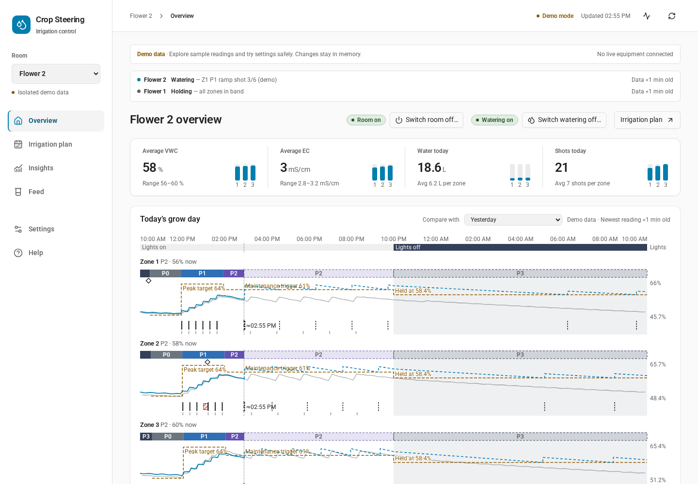

## Tank and pump

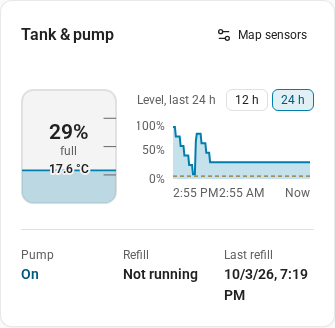

## Insights: water use per zone

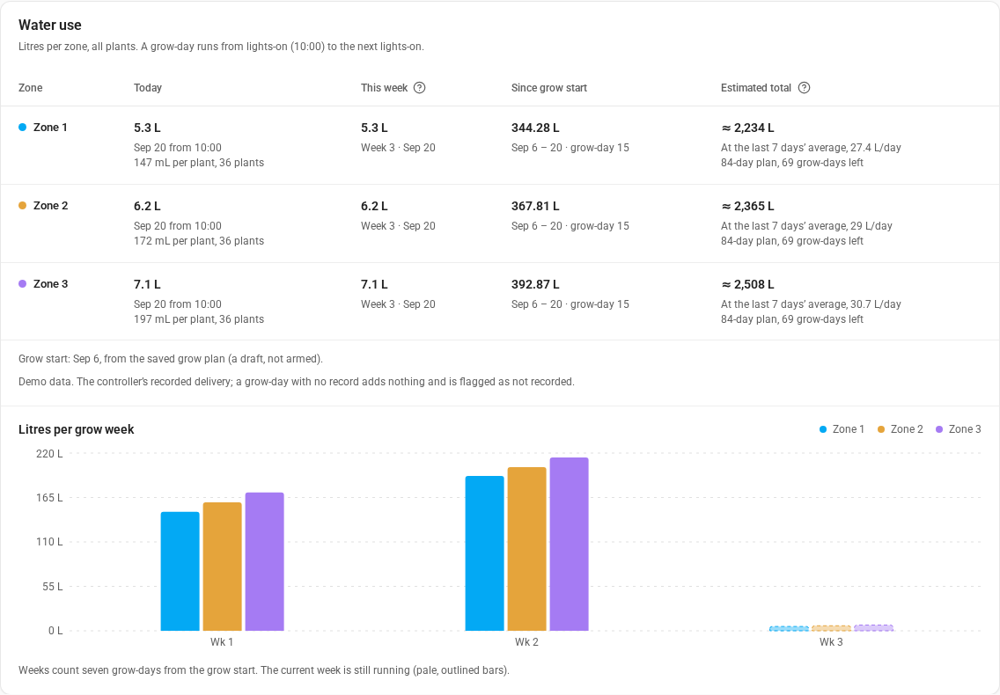

## Feed: Reservoir

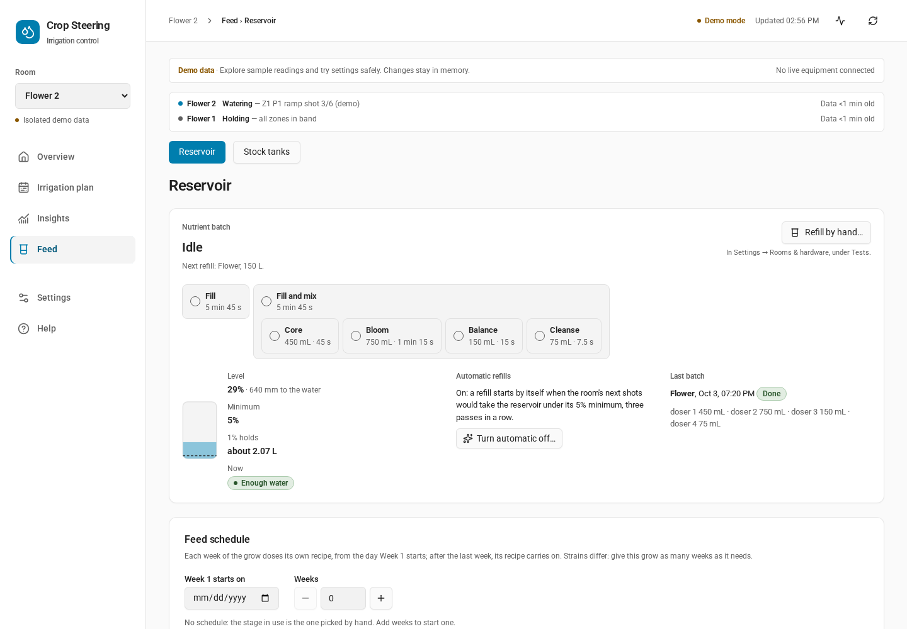

## Feed: Stock tanks

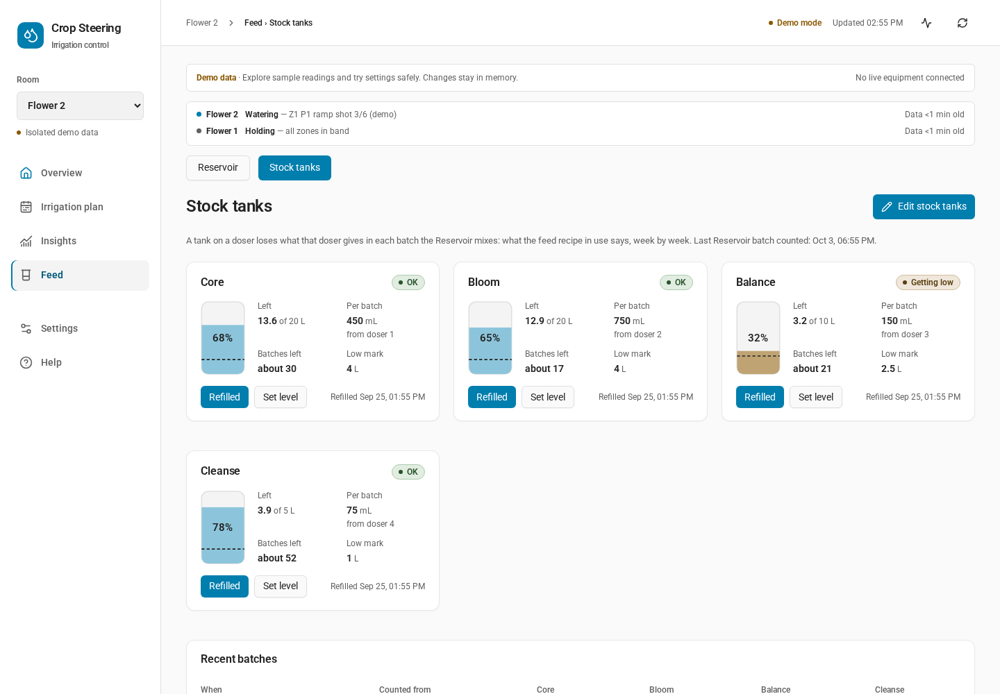

## Irrigation plan: Schedule and combined VWC/EC curve

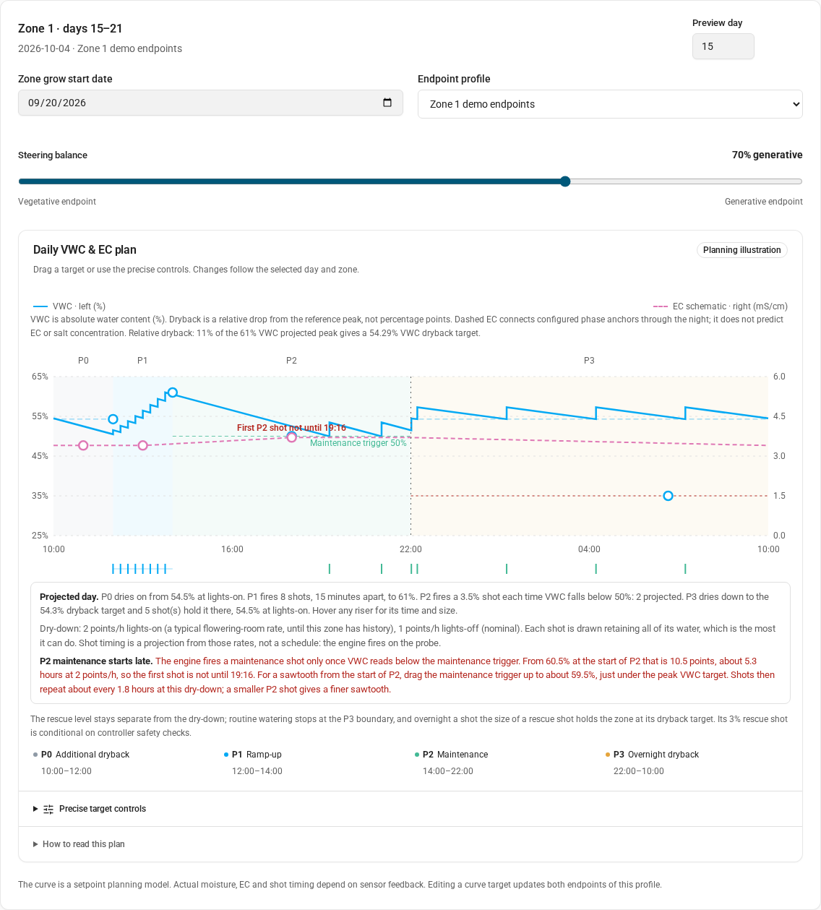

## Irrigation plan: Today, with the recorded zone and the projected day

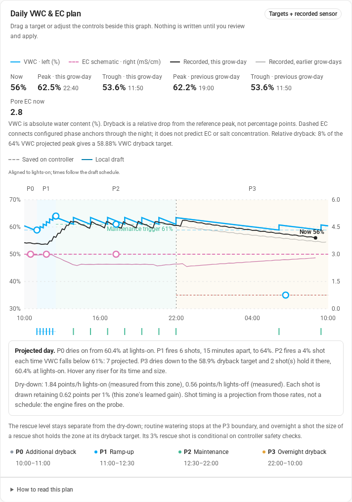

## Recorded sensor history beside the setpoints

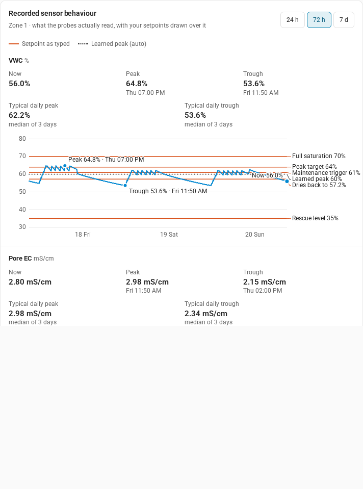

## Irrigation plan: Today beside the plan graph

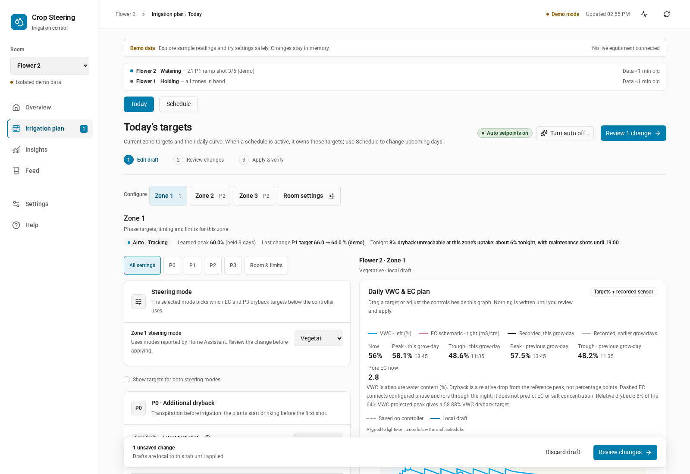

## Room switched off

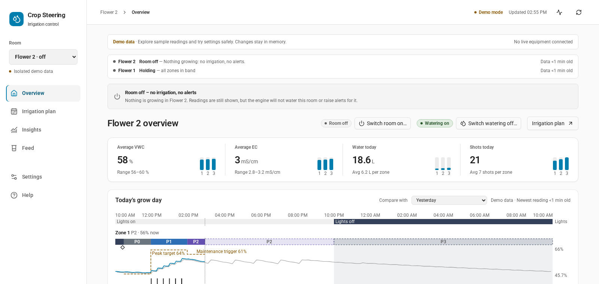

## Insights: Compare runs

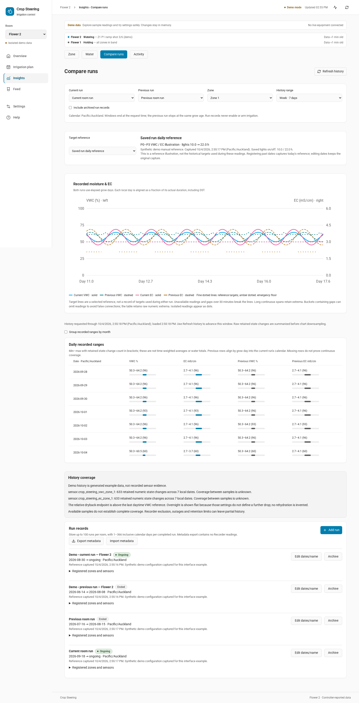

## User-authored recipe library

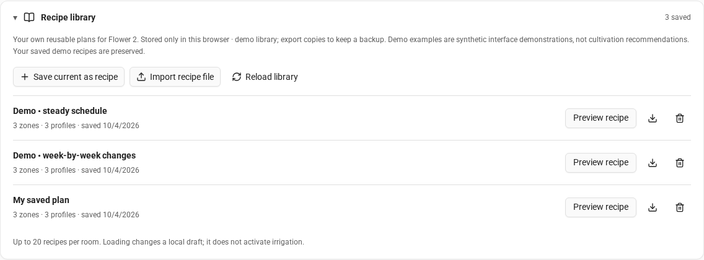

## Settings: Rooms & hardware

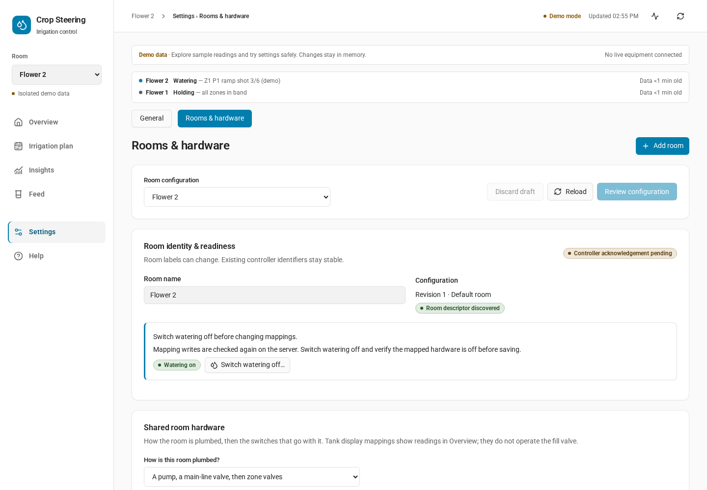

## On a phone

| The Overview | Feed: Reservoir | Irrigation plan: Today |
| --- | --- | --- |
| 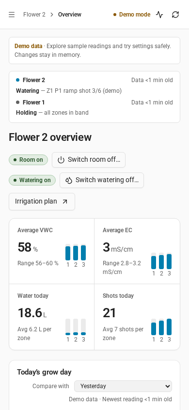 | 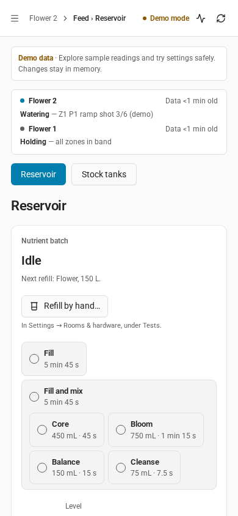 | 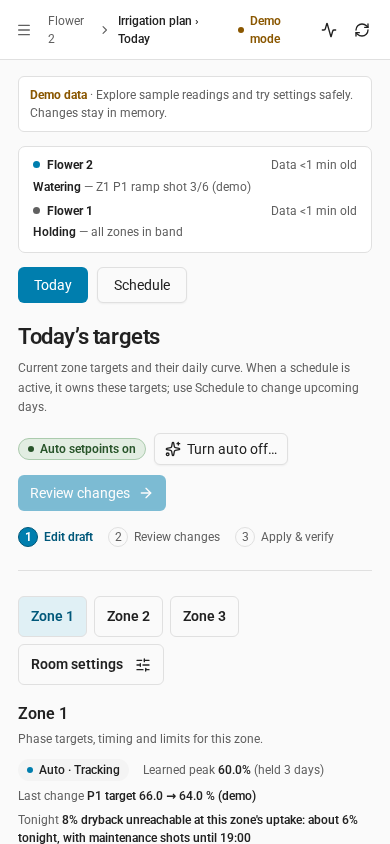 |

Reproduce these captures by building the frontend and running the browser checks in `frontend/scripts/` (`verify-workspace.mjs`, `verify-steering-visuals.mjs`, `verify-dashboard.mjs`, `verify-tank-status.mjs` and `verify-recipe-library.mjs`); each writes its screenshots into `img/`, in the light theme, even where its own checks run dark (`light-shot.mjs`). The README links these images on `ChillingSilence/HA-Irrigation-Strategy` until the public repository has them.
